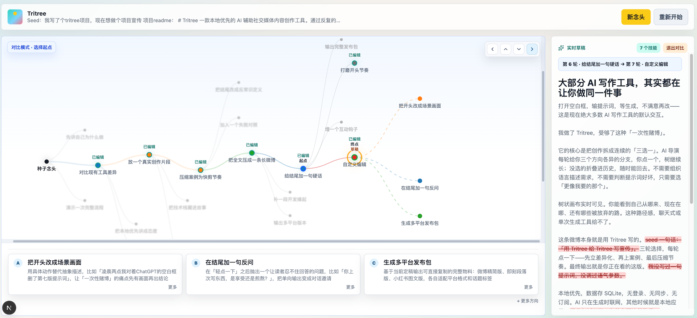

# Tritree

Tritree 是一款 AI 辅助社交媒体内容创作工作台。你从一句 seed 开始，AI 先生成起始草稿，再围绕当前草稿给出三个下一步方向；你选择、改写或自定义分支，作品就在一棵可回溯的创作树里逐轮生长。



## 核心能力

- **Seed 驱动创作**：输入一个念头、问题或素材片段，搭配本次创作要求和启用的 Skills，生成第一版草稿与起始方向。
- **三选一创作树**：每个节点保留草稿、历史路径、折叠分支和下一步建议；支持从历史节点重新分支，也支持自定义方向。
- **方向范围控制**：生成下一步建议时可选择发散、平衡或专注，让三个选项之间的距离更符合当前创作阶段。
- **实时草稿与差异审阅**：草稿生成和下一步建议都走流式输出；支持父子版本 diff、任意两个节点对比、手动编辑保存。
- **选中文本 AI 改写**：在正文中选中片段并给出指令，AI 只改写选区，再把结果接回当前草稿。
- **发布助手**：把草稿整理成微博、小红书、朋友圈版本，提供标题、正文、话题、配图提示词和平台检查。
- **草稿管理**：`/drafts` 页面列出未归档草稿，可打开、重命名、归档；「新念头」会创建新的创作主题。
- **Skill 系统**：内置系统 Skills，也可以新建用户 Skills，或从 GitHub 导入带 `SKILL.md` 的 Tritree Skill；启用后会影响草稿生成和编辑建议。
- **多用户自托管**：首次启动创建管理员；管理员负责创建用户、重置密码、停用账号和绑定 OIDC 身份。每个用户只访问自己的根记忆、草稿和 Skills。

## 技术栈

| 层级 | 技术 |
| --- | --- |
| 应用框架 | Next.js 16 App Router + React 19 |
| AI 执行 | Mastra Agent + AI SDK Anthropic-compatible provider |
| 认证 | NextAuth v4 Credentials / OIDC |
| 数据 | SQLite `node:sqlite`，Drizzle schema 作为表结构镜像 |
| 可视化与编辑 | D3.js、CodeMirror diff/merge、lucide-react |
| 样式 | 全局 CSS |
| 校验与测试 | TypeScript、Zod、Vitest、Testing Library |

## 快速开始

### 环境要求

- Node.js >= 24.0.0

### 安装依赖

```bash
npm install
```

### 配置环境变量

复制示例配置：

```bash
cp .env.example .env.local
```

编辑 `.env.local`，至少配置 AI 接口和本地数据库：

```env
ANTHROPIC_BASE_URL=https://your-provider.example/anthropic
ANTHROPIC_AUTH_TOKEN=your_api_key_here
ANTHROPIC_MODEL=your_model_name

TRITREE_DB_PATH=.tritree/tritree.sqlite
TRITREE_SKILL_EXECUTION_MODE=auto
```

补充说明：

- `ANTHROPIC_BASE_URL` 会自动补齐 `/v1` 后缀，以适配 AI SDK 的 Anthropic provider。
- 本地开发没有配置 `NEXTAUTH_SECRET` 时会使用开发默认值；生产环境请显式设置随机长字符串。
- 可选 OIDC 登录变量：`OIDC_ISSUER`、`OIDC_CLIENT_ID`、`OIDC_CLIENT_SECRET`、`OIDC_SCOPE`。
- `TRITREE_SKILL_EXECUTION_MODE` 可取 `auto`、`trusted-host` 或 `macos-seatbelt`。

### 启动

```bash
npm run dev
```

访问 [http://localhost:3000](http://localhost:3000)。首次启动且数据库里没有用户时，会进入管理员初始化页；第一个用户会成为管理员。

## 使用流程

1. 登录工作区；首次自托管部署先创建管理员。
2. 点击「新念头」，输入创作 seed，选择本次创作要求和本轮启用的 Skills。
3. 在创作树里选择一个方向，或自定义方向；AI 生成下一版草稿和下一轮选项。
4. 在实时草稿里审阅 diff、手动编辑，或对选中文本发起 AI 改写。
5. 内容接近完成后打开发布助手，复制适合微博、小红书或朋友圈的版本。
6. 到「我的草稿」继续旧作品、重命名或归档不再需要的草稿。

## Skill 导入

Tritree Skill 可以是普通提示词，也可以是带 `SKILL.md` 的 GitHub 仓库。导入后，它会作为创作指令参与草稿生成和编辑建议；如果 Skill 提供额外工具能力，Tritree 会在本轮 AI 任务中按需使用。

## 开发命令

```bash
npm run dev          # 启动开发服务器
npm run build        # 构建生产版本
npm test             # 运行测试
npm run test:watch   # 监听模式运行测试
npm run typecheck    # TypeScript 类型检查
```

## 数据与部署注意

数据默认存储在项目根目录 `.tritree/tritree.sqlite`，可通过 `TRITREE_DB_PATH` 修改；旧变量 `TREEABLE_DB_PATH` 仍兼容。数据库包含用户、OIDC 绑定、根记忆、快捷创作要求、Skills、会话树、草稿版本、发布包和 Skill 工具记忆。

请备份 `.tritree/` 目录；如果使用外部 Skills，也建议备份 `~/.tritree/skills`。OIDC 登录不会自动创建本地用户，管理员需要先在用户管理中绑定 issuer 和 subject。

## License

Apache License 2.0. See [LICENSE](./LICENSE).
